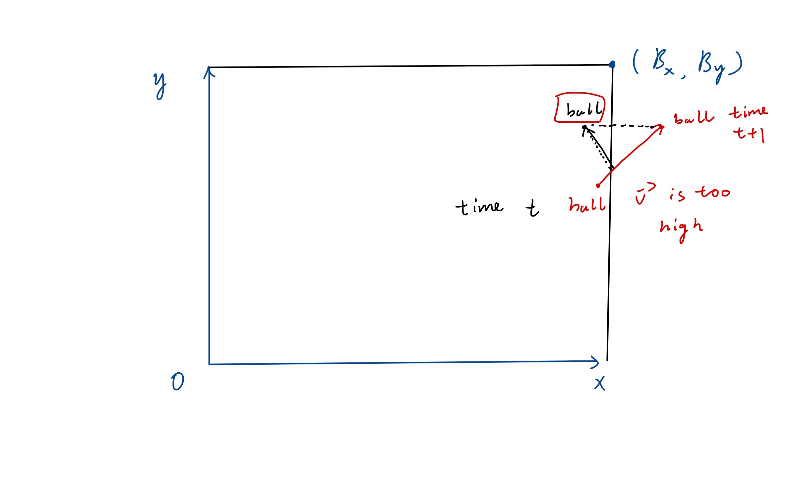

# Physics of Billiard Game

## Coordinates and Notations

Suppose the coordinate system is like the below.


The boundary of the desk is $(B_x, B_y)$. 

The coordinate of a ball is $\vec{p}_{t} = (x,y)$ at time $t$. 

And the velocity of the ball is $\vec{v}_{t,\vec{p}}=(v_x, v_y)$, given its position and a time and the magnitude of $\vec{v}_{t,\vec{p}}$ is simply denoted as $v_{t,\vec{p}}$.

The ball has a mass of $m$ and a radius $r$.

The board has a friction coefficient of $\mu$.

And we have a gravity of $g$.

We only care about translations, ignoring rotations.

### Notice

We could also have another frame, which is screen space, and the coordinate mentioned above is the world space. Naturally the screen space is scaled and discretized from the world coordinate. 

Doing so may help to handle numeric inaccuracy, since we can do all the arithmetics in world space with fixed/float point numbers and then discretize values into the screen space and display objects in screen space.

## Cases of single ball

### Collision with the boundary

* When the position $\vec{p}[x]\ge B_x - r$ or $\vec{p}[x]\le r$, we set $\vec{v}[x]\leftarrow - \vec{v}[x]$.
* When the position $\vec{p}[y]\ge B_y - r$ or $\vec{p}[y]\le r$, we set $\vec{v}[y]\leftarrow - \vec{v}[y]$.

#### Algorithm

```
For every time step:
	For every ball:
		we check the above two conditions.
			if any of them is met, we update the velocity.
		we update the position for the next time step.
```

### Translation with frictions

Suppose we have a ball at velocity $\vec{v}_{t,\vec{p}}$ and the time step is $\Delta t$.

With momentum, we have
$$
\begin{align}
m\Delta \vec{v} &= \vec{F}\Delta t\\
&= \mu m g \Delta t\\
\Delta\vec{v} &= \mu g \Delta t
\end{align}
$$
Since the friction is dragging the ball slow, the $\vec{F}$ is at the opposite direction of $\vec{v}$, then we have

$\vec{v}_{t+\Delta t} = \vec{v}_{t,\vec{p}}-\Delta \vec{v}$.

The new position can also be calculated as follows.
$$
Avg\ speed\ \ v_{avg} = \frac{(v_{t,\vec{p}} + v_{t+\Delta t})}{2}\\
Translated\ distance\ \ s = v_{avg}*\Delta t\\
then\ the\ new\ position\ \\ \vec{p}_{t+\Delta t} = \vec{p}_{t} + s*\frac{\vec{v}_{t,\vec{p}}}{v_{t,\vec{p}}}
$$

#### Algorithm

```
For every time step:
	For every ball:
		Calculate the velocity of next time step
		Calculate the new position of next time step
		Show the ball with current position
		Check if any collision with the boundary and potential collision of next time step.
```

#### Notice

##### Velocity “Overflow”

When the velocity is too high, we should check collisions of next time step to avoid the ball crossing through the boundary. Moreover, we may need to handle the case shown below.



At current time step, we can:

* Treat this case as if the ball hits the boundary and “reverse” its velocity, and then calculate the position of next time step.
* Or, more expensively, calculate the exact collision position and solve for the exact position of next time step.

##### Velocity “Underflow”

When the velocity is too small, the position does not change a lot, then when we display the ball, the ball stays at the same pixels. In this case, we need to introduce a world space, which is mentioned above, with higher precisions than the screen space and do the arithmetics in the world space.