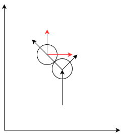

# Physics of Billiard Game

## Coordinates and Notations

Suppose the coordinate system is like the below.


The boundary of the desk is $(B_x, B_y)$. 

The coordinate of a ball is $\vec{p}_{t} = (x,y)$ at time $t$. 

And the velocity of the ball is $\vec{v}_{t,\vec{p}}=(v_x, v_y)$, given its position and a time and the magnitude of $\vec{v}_{t,\vec{p}}$ is simply denoted as $v_{t,\vec{p}}$.

The ball has a mass of $m$ and a radius $r$.

The board has a friction coefficient of $\mu$.

And we have a gravity of $g$.

We only care about translations, ignoring rotations.

### Notice

We could also have another frame, which is screen space, and the coordinate mentioned above is the world space. Naturally the screen space is scaled and discretized from the world coordinate. 

Doing so may help to handle numeric inaccuracy, since we can do all the arithmetics in world space with fixed/float point numbers and then discretize values into the screen space and display objects in screen space.

## Cases of single ball

### Collision with the boundary

* When the position $\vec{p}[x]\ge B_x - r$ or $\vec{p}[x]\le r$, we set $\vec{v}[x]\leftarrow - \vec{v}[x]$.
* When the position $\vec{p}[y]\ge B_y - r$ or $\vec{p}[y]\le r$, we set $\vec{v}[y]\leftarrow - \vec{v}[y]$.

#### Algorithm

```
For every time step:
	For every ball:
		we check the above two conditions.
			if any of them is met, we update the velocity.
		we update the position for the next time step.
```

### Translation with frictions

Suppose we have a ball at velocity $\vec{v}_{t,\vec{p}}$ and the time step is $\Delta t$.

With momentum, we have
$$
\begin{align}
m\Delta \vec{v} &= \vec{F}\Delta t\\
&= \mu m g \Delta t\\
\Delta\vec{v} &= \mu g \Delta t
\end{align}
$$
Since the friction is dragging the ball slow, the $\vec{F}$ is at the opposite direction of $\vec{v}$, then we have

$\vec{v}_{t+\Delta t} = \vec{v}_{t,\vec{p}}-\Delta \vec{v}$.

The new position can also be calculated as follows.
$$
Avg\ speed\ \ v_{avg} = \frac{(v_{t,\vec{p}} + v_{t+\Delta t})}{2}\\
Translated\ distance\ \ s = v_{avg}*\Delta t\\
then\ the\ new\ position\ \\ \vec{p}_{t+\Delta t} = \vec{p}_{t} + s*\frac{\vec{v}_{t,\vec{p}}}{v_{t,\vec{p}}}
$$

#### Algorithm

```
For every time step:
	For every ball:
		Calculate the velocity of next time step
		Calculate the new position of next time step
		Show the ball with current position
		Check if any collision with the boundary and potential collision of next time step.
```

#### Notice

##### Velocity “Overflow”

When the velocity is too high, we should check collisions of next time step to avoid the ball crossing through the boundary. Moreover, we may need to handle the case shown below.


At current time step, we can:

* Treat this case as if the ball hits the boundary and “reverse” its velocity, and then calculate the position of next time step.
* Or, more expensively, calculate the exact collision position and solve for the exact position of next time step.

##### Velocity “Underflow”

When the velocity is too small, the position does not change a lot, then when we display the ball, the ball stays at the same pixels. In this case, we need to introduce a world space, which is mentioned above, with higher precisions than the screen space and do the arithmetics in the world space.

## Two Ball Collision

Suppose we have two balls A and B, and they have positions and velocities as 
$$
\vec{p}_{A,t}\\
\vec{p}_{B,t}\\
\vec{v}_{A,\vec{p},t}\\
\vec{v}_{B,\vec{p},t}
$$
And we have a world coordinates for the above vectors.



With the derivation in [The physics of Billiards](https://www.real-world-physics-problems.com/physics-of-billiards.html), we know that if a moving billiard collides with another stationary billiard, the stationary one will move along the direction of the connection of two centroids, and the collider will move in a direction perpendicular to that direction. 

However, we need to calculate velocities in the case where two billiards both have velocities. So, we introduce a local frame, in which a billiard’s centroid is the origin. Then in the local frame, the billiard at the origin is stationary, and thus we can calculate everything in this frame with the same stationary assumption.

Suppose we set A as the reference of the local frame, then we have
$$
\vec{v}_{A,t,local} = 0\\
\vec{v}_{B,t,local} = \vec{v}_{B,t} - \vec{v}_{A,t}\\
\vec{p}_{A,t,local} = 0\\
\vec{p}_{B,t,local} = \vec{p}_{B,t} - \vec{v}_{A,t}
$$
, then we calculate velocities after a collision in this frame and convert the results back to the world coordinate.

The directions are easy to compute if we extend the dimension to 3D. We can use cross products to find out the direction of velocity of the collider (which is B here) after the collision.

Once we have the directions of after-collision velocities, we can calculate the magnitudes by solving a linear system.

Suppose the magnitudes are $\alpha$ and $\beta$, and the directions are $\vec{d}_A$ and $\vec{d}_B$.

By the conservation law of momentum, we have
$$
\vec{v}_{A,t,local} + \vec{v}_{B,t,local} = \alpha\vec{d}_A+\beta\vec{d}_B
$$
Let the momentum to be$ [x, y]^T$.

Rewriting the above equation, we get
$$
\begin{equation*}
\begin{bmatrix}
d_A[x] & d_B[x]\\
d_A[y] & d_B[y]
\end{bmatrix}
\begin{bmatrix}
\alpha\\
\beta
\end{bmatrix}=\begin{bmatrix}
x\\
y
\end{bmatrix}
\end{equation*}
$$
Since $\vec{d}_A$ and $\vec{d}_B$ are unit vectors and orthogonal to each other, the inverse of the above matrix is its transpose. So, we can calculate the magnitudes like
$$
\begin{equation*}
\begin{bmatrix}
\alpha\\
\beta
\end{bmatrix}=
\begin{bmatrix}
d_A[x] & d_A[y]\\
d_B[x] & d_B[y]
\end{bmatrix}
\begin{bmatrix}
x\\
y
\end{bmatrix}
\end{equation*}
$$
Once we have the magnitudes and directions, we get velocities in the local frame, then we only need to convert them into the world coordinate.

### Technical issues

* We need some complex operators:
    * Division
    * Square root
    * Multiplication
* Two balls may overlap, which is “solved” in the code `rectify_positions_in_collision()`

